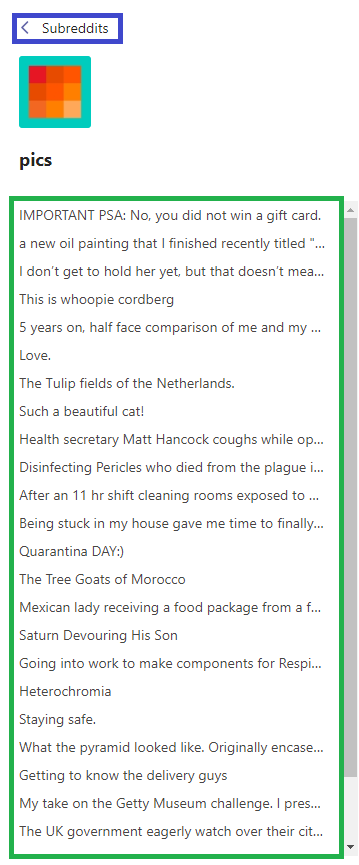
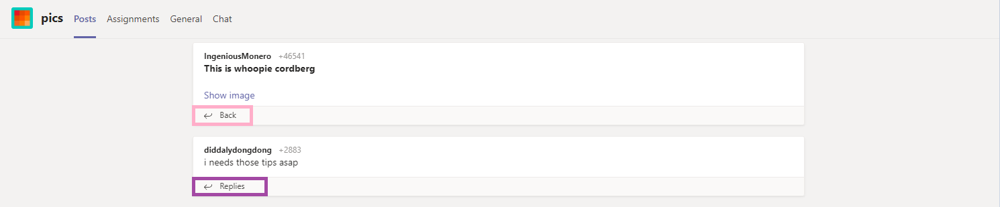

# teamit
> Microsoft Teams skin for Reddit [abberispe.github.io/teamit](abberispe.github.io/teamit)

This website is for people wanting to scroll Reddit while being at work, school etc. Inspired by pcottle's [MSOutlookit](https://github.com/pcottle/MSOutlookit)

## Usage
#### Below are some not so obvious features explained:
- - -
\
**Red square** for removing subreddits from the teams menu.\
**Add subreddit** for adding subreddits to the teams menu.
- - -
\
When you have chosen a subreddit, the hot posts will appear in the **green** left column.\
**Blue** takes you back to the teams menu.
- - -
\
When you have chosen a post, the post will appear at the top. Title in bold.\
Below the post are the comments. Press **purple** to see the replies of the comment. To go back after pressing **purple**, press **pink**.
